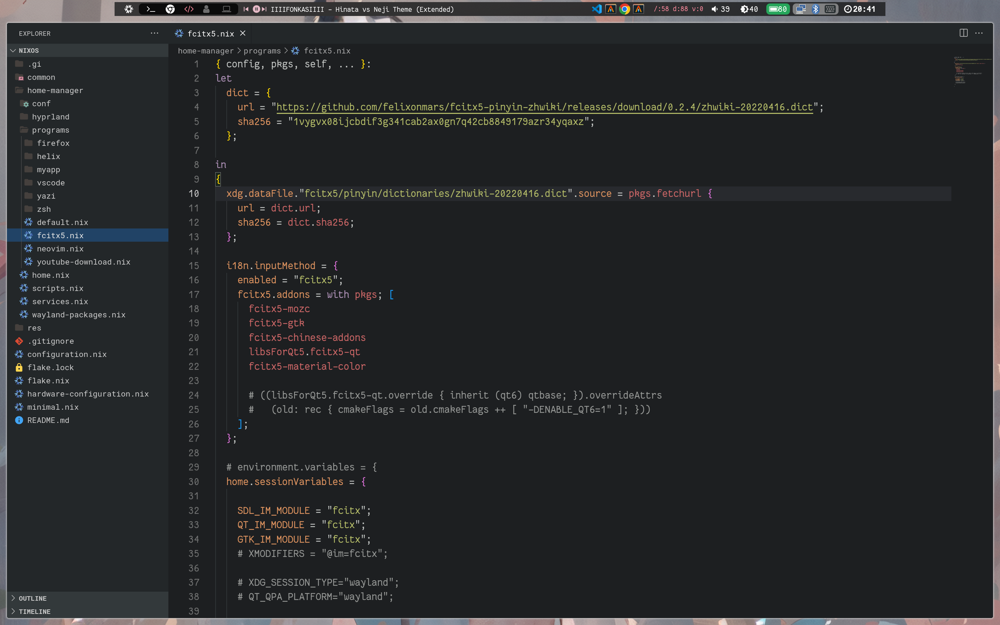
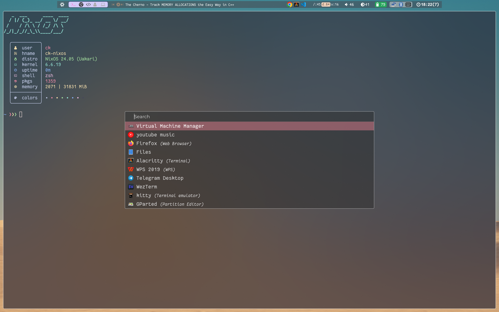

# nixos-hypr3

## best combination

> hyprland + waybar + rofi

## Tools:

* bar - waybar
* launcher - rofi-wayland
* screenshot - grim+swappy+slurp,grimblast
* terminal - kitty,foot 
* monitor - htop,gotop
* wallpaper - swww
* notify - dunst+libnotify
* colorscheme - pywal
* cliperboard - rofi+cliphist

* pdf - zathura,mupdf
* img - imv,viewnior,nomacs
* filebrowser - thunar, yazi
* editor - helix
* shell - zsh

* network - nm-applet
* bluetooth - blueman-applet
* audio - pavucontrol
* brightness - brightnessctl
* powerManager - power-profile-daemon

